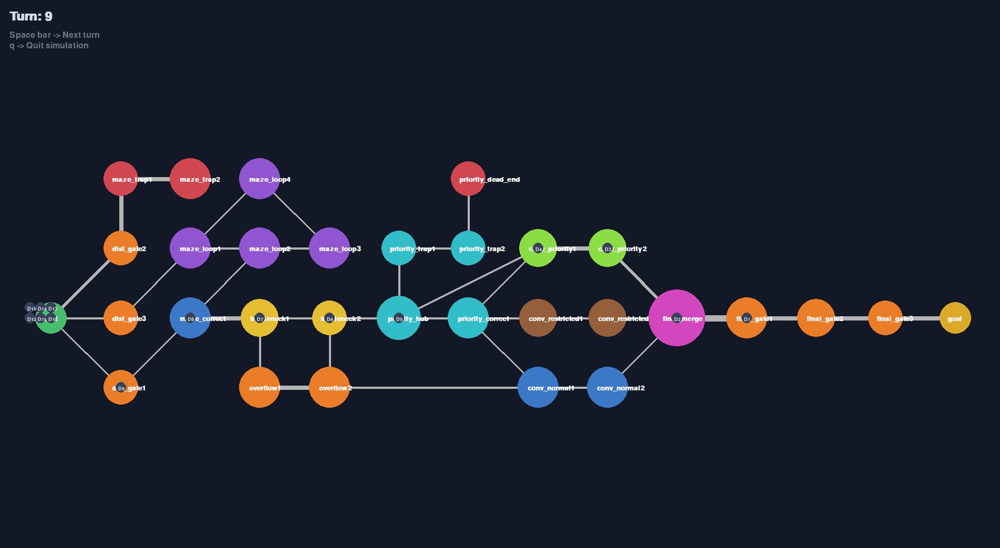

_This project has been created as part of the 42 curriculum by czuluaga_

# Fly-In

## Description

Fly-In is a Python project that simulates the movement of drones through a network of hubs and connections. Each map defines a start point, a goal point, and a set of nodes with different rules such as restricted zones, priority zones, colors, and capacities. The goal of the program is to dispatch drones efficiently while respecting the limits of the network.

This project is a practical example of graph flow and pathfinding. It shows how routing problems appear in real systems such as traffic management, package delivery, network routing, and automated logistics.



## Instructions

The project uses a simple Makefile to help run and validate the simulation.

- **make install**: creates a Python virtual environment and installs the required dependencies from requirements.txt.
- **make run**: runs the simulation with the default map located in maps/easy/01_linear_path.txt.
- **make debug**: starts the program in Python debugger mode.
- **make clean**: removes temporary files such as cache folders.
- **make lint**: runs flake8 and mypy to check code quality.
- **make lint-strict**: runs a stricter version of the static checks.

You can also run the simulator with any other map:

```
make run MAP=<map_file>
```

For example:

```
make run MAP=maps/medium/03_priority_puzzle.txt
```

Maps have to follow this structure:

- The first line defines the number of drones with `nb_drones: <number>`.
- Each zone is defined on its own line using one of these prefixes:
  - `start_hub: <name> <x> <y> [metadata]` for the starting zone.
  - `end_hub: <name> <x> <y> [metadata]` for the goal zone.
  - `hub: <name> <x> <y> [metadata]` for a regular zone.
- Metadata is optional and must be written inside brackets `[...]`.
- Supported metadata fields are:
  - `zone=<type>` with possible values `normal`, `blocked`, `restricted`, or `priority`.
  - `color=<value>` for visual representation.
  - `max_drones=<number>` to limit how many drones can occupy the zone at the same time.
- Connections are written as `connection: <name1>-<name2> [metadata]`.
- Connection metadata is optional and may include `max_link_capacity=<number>` to limit how many drones can use that connection at once.

Example:

```text
nb_drones: 2

start_hub: start 0 0 [color=green]
hub: middle 1 0 [zone=priority color=blue]
end_hub: goal 2 0 [color=red]

connection: start-middle
connection: middle-goal [max_link_capacity=2]
```

## Resources

The implementation was inspired by general graph theory and pathfinding concepts. These resources were useful for understanding graph structures and shortest path algorithms:

- [C-like structures in Python](https://stackoverflow.com/questions/35988/c-like-structures-in-python)
- [Python data structures and graphs](https://www.w3schools.com/python/python_dsa_graphs.asp)
- [Representing graphs in Python](https://stackoverflow.com/questions/19472530/representing-graphs-data-structure-in-python)
- [Dijkstra's shortest path algorithm](https://www.geeksforgeeks.org/dsa/dijkstras-shortest-path-algorithm-greedy-algo-7/)

### Use of AI

AI assistance was used to help with repetitive coding patterns, explain the pathfinding approach, and structure this README. The project itself was implemented manually and adapted to the requirements of the simulation.

## Algorithm

### Algorithm Choice

The dispatcher uses a Dijkstra-style strategy to minimize the turn cost of each drone route. This choice is well suited for the project because the network is a weighted graph: each zone has a different travel cost, and the goal is to find the path that reaches the destination with the smallest total cost in terms of turns. Instead of simply taking the path with the fewest nodes, the algorithm evaluates the cost of each edge and prefers routes that are cheaper over time.

This approach is especially useful in this simulation because the environment is not uniform. Some hubs are normal, some are priority zones that are preferable, some are restricted and take more turns, and some are blocked entirely. Dijkstra is a good fit because it explores the graph from the start point while always keeping the lowest-cost route discovered so far. In other words, it builds a reliable shortest-path structure without needing to test every possible path exhaustively.

The algorithm also works well when several drones must move through the same network. Since each move consumes link and hub capacity, the dispatcher must not only find a path but also adapt to the current state of the system. The shortest-path computation provides a baseline route, and the dispatcher then refines that route in real time by checking whether the next step is still feasible.

### Implementation Strategy

The project is divided into a few core modules:

- map_parser.py reads the custom map format and builds the configuration for the simulation.
- hubs.py defines the hub data structure, including position, zone, color, and capacity.
- graph.py stores the network as a bidirectional graph and tracks link occupancy.
- network.py manages drones, computes paths, and dispatches them turn by turn.
- visuals.py uses pygame to display the network and animate the movement of drones.

The routing logic works in two stages. First, the program computes the shortest valid paths from the start hub to the goal by exploring the graph and updating the distance of each reachable hub. When two paths reach the same hub with the same total cost, both are kept as equally short alternatives. This allows the dispatcher to preserve more than one possible route and to choose the best one depending on the current state of the network.

Once the possible paths are known, the next step of each drone is calculated by walking backward from the goal through the stored parent links. That gives the drone a valid next hop that still leads to the goal. Before sending a drone, the program checks whether the chosen link and the destination hub still have available capacity. If either one is full, that option is skipped and the dispatcher tries the next valid step.

The system also uses a value called `deepness` for each drone. A drone’s deepness increases as it progresses further into the network, and the dispatcher prioritizes drones with higher deepness when deciding which drones should move first. This is important because it helps the simulation release capacity from the front of the network sooner, making space for drones that are still waiting behind them.

## Visual Representation

The visual part of the project is built with pygame and shows the map as a graph of connected hubs.

### Features

Each hub is drawn as a circle with a size and color that depend on its configuration. Connections are shown as gray lines, and their thickness increases with the link’s maximum capacity so stronger routes are easier to notice. Drones are displayed moving through the network, making it easier to understand the flow of traffic across the map.

### Enhanced User Experience

The simulation advances turn by turn. Pressing the space bar moves the animation forward, while the q key exits the simulation. This makes it easy to follow how each drone moves and how the network changes over time.
